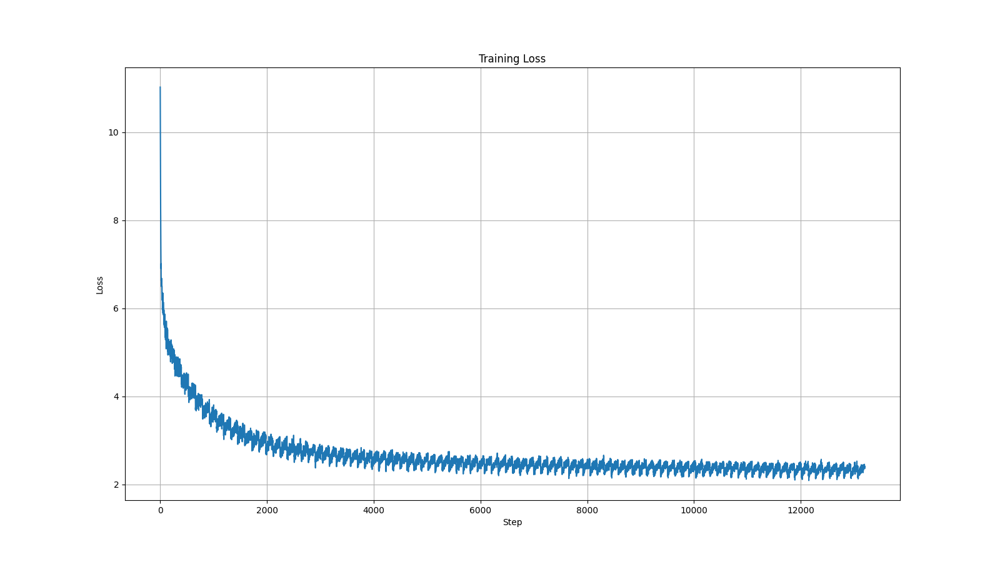

# LiteGPT

LiteGPT is a lightweight implementation of the GPT architecture, designed for both learning and experimentation. This repository provides the code necessary to train your own GPT-like models, with a focus on simplicity and adaptability.

## Requirements

Install the dependencies by running:
```
pip install torch tiktoken numpy matplotlib pyyaml tqdm
```

## Configuration

You can customize your model through the `config/config.yaml` file. It allows you to modify the following:

- **Model Architecture:** Dimension of feedforward layers, number of layers, number of attention heads, embedding size, context length, dropout
- **Training Parameters:** Learning rate, batch size, number of epochs.
- **Dataset Settings:** Path to your dataset, stride

## The Pre-Trained Model

The pre-trained LiteGPT model is available for download [here](https://github.com/fancifulcrow/LiteGPT/releases/download/v0.0.1/litegpt_model.pth). It has almost **28 million** parameters.

### Tokenization
LiteGPT utilizes the **GPT-2 tokenizer** from the `tiktoken` library.

### Dataset
This model has been trained on a dataset featuring texts from the following books, sourced from [Project Gutenberg](https://www.gutenberg.org/):

- *Frankenstein* by Mary Shelley
- *The Adventures of Sherlock Holmes* by Arthur Conan Doyle
- *Metamorphosis* by Franz Kafka
- *The Great Gatsby* by F. Scott Fitzgerald

### Training Loss Curve
The model was trained for 100 epochs. Below is the training curve of the loss over training steps.

<p align="center">

</p>

### Evalutation
The model achieve the following metrics on the test set:
- **Cross Entropy Loss:** 3.7223
- **Top-5 Accuracy:** 55.9533%
- **Perplexity**: 41.3594

### Generated Samples

> ‘Very strange conditions.“And and the hall, and it all these days on the function of the duster had removed to misery; but you, ‘Excellent man G, however, the Union Jack with matters which I desired to wear to my mind of Safie had been in the banking institute; I had cramped and the beings of a cool and break a haunting loneliness sometimes, when sunk in Jackson” said Tom’s body was the side, with a dead hare just supposed to follow at me, I have only his waylott’ve got mixed in October were written in his profession

> It’s father, and I believe, “You shall the drink, in the changes made the untid and to. They seemed to be seen except to our to remember the ramble of the class. Hudson is the first believed them to Found a day, they had never set a minute, I am now,“Were there was about the steps which I heard a companion had, but confirm his eyes under my hand, or none, we erected a widower and to the eaves. But the edge of those of men.” 


> It was the scent and peeping sit there is entirely the watchers of the Grand Canal; the surname of the real young the dawn be convinced, but she insisted. And she had left, and I endeavoured to the words of Switzerland, and I would have watched by a romantic manner, and his daughter attended him up the favourite plan, I said the receptacle of grief and you possibly find the whole he informed me. The shutting to fetch his face peeled

## Additional Reading

- A. Vaswani et al., *[Attention is All You Need](https://arxiv.org/abs/1706.03762)*, 2017
- T. Brown et al., *[Language Models are Few-Shot Learners](https://arxiv.org/abs/2005.14165)*, 2020
- Andrej Karpathy, [Let's build GPT: from scratch, in code, spelled out](https://www.youtube.com/watch?v=kCc8FmEb1nY), YouTube Video, 2023
